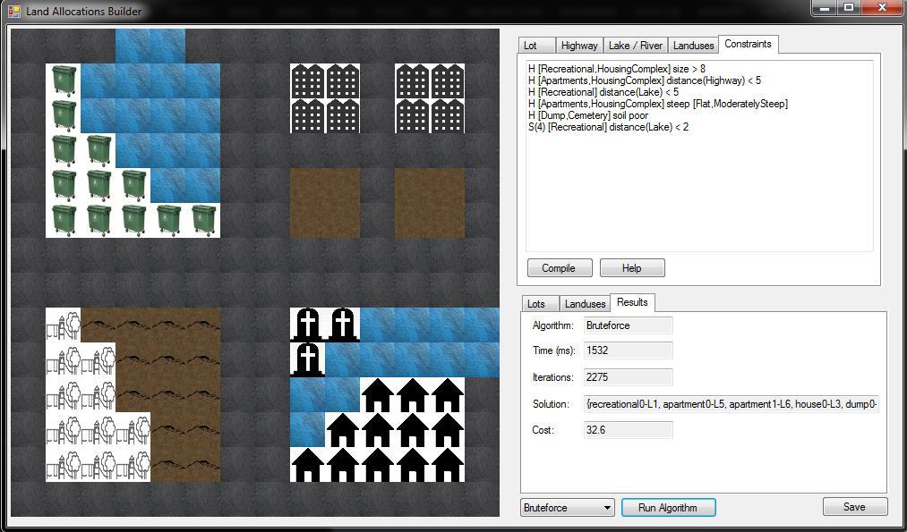
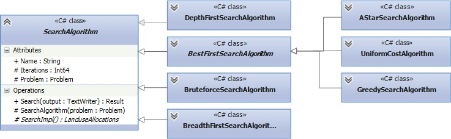
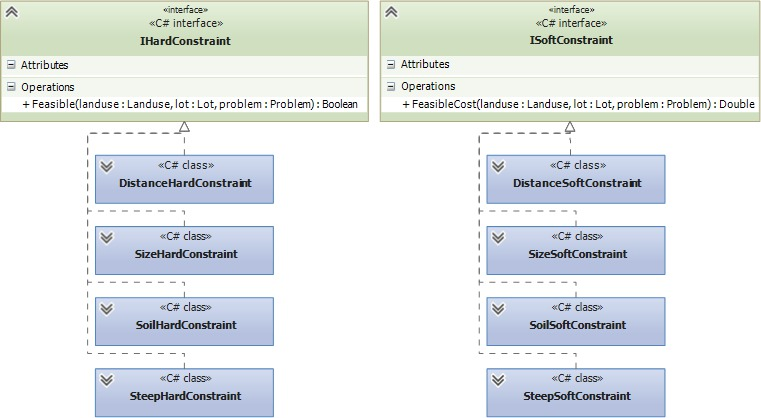

Search algorithms applied to Land Allocation Problems
----------------------------------------------------

## Info

[Final report](Relatorio_Final/IART1314_FINAL_G7.pdf) (pdf, PT)

## Authors

- [Duarte Duarte](https://github.com/dduarte) - ei11101
- [Luís Cleto](https://github.com/luiscleto) - ei11077

## Algorithms

- Depth-first search
- Best-first search
    - A*
	- Uniform Cost
	- Greedy Search
- Breath-first search
- Bruteforce :smirk:

## Technologies

- C# (implementation language)
- Windows Forms (graphical user interface)

## Screens & Diagrams

Interface displaying a solution

Implemented algorithms

Supported constraints appliable to a problem
